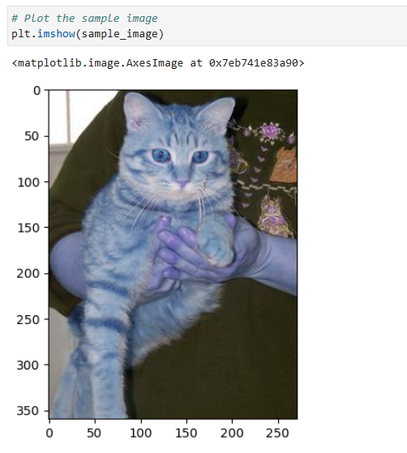

# 🐱🐶 Cat vs Dog Classifier using SVM and HOG

This project trains a **Support Vector Machine (SVM)** to classify images of cats and dogs using **Histogram of Oriented Gradients (H.O.G.)** features.  
It is part of the coursework for **1501112: Individual Project** supervised by **Dr. Surapol V.**, Mae Fah Luang University.

---

## 📘 Overview

Humans can easily distinguish cats from dogs, but how can a machine do it?  
This project demonstrates how to:
- Extract H.O.G. features from input images
- Train an SVM model for binary image classification
- Tune hyperparameters with Grid Search
- Predict new unseen images (cat or dog)

---

## 🧠 Technologies Used

| Library | Purpose |
|----------|----------|
| `numpy` | Numerical computations |
| `matplotlib` | Visualization and plotting |
| `opencv-python` | Image processing |
| `scikit-image` | H.O.G. feature extraction |
| `scikit-learn` | SVM model training and evaluation |
| `imutils` | Simplified image handling |
| `skillsnetwork` | Dataset download (for IBM Skills Network environment) |

---

## 🧾 Requirements

All dependencies are listed in `requirements.txt`.  
To install them, run:

```bash
pip install -r requirements.txt
````

If you are **not using IBM Skills Network Labs**, you can safely remove `skillsnetwork` from the file and download the dataset manually.

---

## 🚀 How to Run

1. **Clone this repository**

   ```bash
   git clone https://github.com/<your-username>/cat-dog-classifier-svm.git
   cd cat-dog-classifier-svm
   ```

2. **Install dependencies**

   ```bash
   pip install -r requirements.txt
   ```

3. **Open the notebook**

   ```bash
   jupyter notebook Project_5931501001.ipynb
   ```

4. **Run all cells**

   * The notebook will:

     * Download and preprocess the dataset
     * Extract H.O.G. features
     * Train and tune the SVM classifier
     * Evaluate the model on test data

5. **Predict on new images**

   * Upload any `.jpg` or `.png` file (cat or dog)
   * Modify the line:

     ```python
     my_image = cv2.imread("cat1.jpg")
     run_svm(my_image)
     ```
   * The model will print:

     ```
     Your image was classified as a cat 🐱
     ```

---

## 📊 Example Output

| Step                  | Screenshot                                 |
| --------------------- | ------------------------------------------ |
| Original Image        |  |
| H.O.G. Visualization  |         |
| Classification Result | `Your image was classified as a cat 🐱`    |

*(You can add screenshots from your results in the `assets/` folder.)*

---

## 🧪 Dataset Information

The dataset consists of labeled cat and dog images downloaded from:

```
https://cv-studio-accessible.s3.us-south.cloud-object-storage.appdomain.cloud/cats_dogs_images_.zip
```

Annotations are provided in a JSON file (`_annotations.json`) that maps image filenames to labels.

---

## 🧑‍💻 GitHub acc name - ThuRein-110

---

## 📄 License

This project is created for educational purposes.
Feel free to reuse and modify with proper attribution.

---

```

